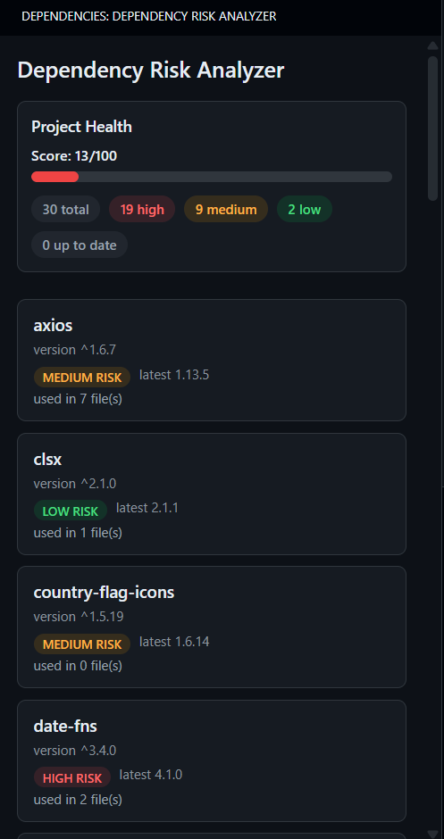
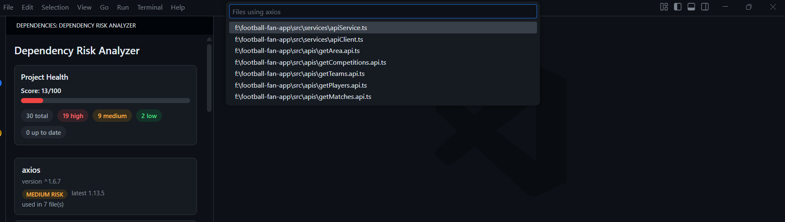

# Dependency Risk Analyzer

Analyze, monitor, and understand your project’s npm dependency health directly inside Visual Studio Code.

Dependency Risk Analyzer helps developers identify outdated packages, assess upgrade risk, measure real usage impact, and track overall project dependency health — all without leaving the editor.

---

## ✨ Features

### 🔍 Dependency Version Analysis
- Detect installed vs latest npm package versions
- Identify major, minor, and patch update gaps
- Clear visual risk classification

### ⚠️ Risk Classification
Dependencies are automatically categorized:

- 🔴 **High Risk** → Major version behind (breaking changes likely)
- 🟠 **Medium Risk** → Minor version behind
- 🟢 **Low Risk** → Patch update available
- ⚪ **Up to Date**

### 📊 Project Health Score
Get an instant health score (0–100) based on:
- dependency risk levels
- real usage impact
- overall upgrade exposure

Includes visual health bar and summary dashboard.

### 📈 Usage Impact Detection
See how many files import each dependency.
This helps identify:

- high-impact upgrade risks
- rarely used libraries
- potential cleanup opportunities

### 🧭 Interactive Dashboard
Modern sidebar UI with:

- clickable dependency cards
- risk badges
- usage counts
- clickable file navigation
- risk filtering (high / medium / low / up-to-date)

### 🧪 Smart Filtering
Filter dependencies instantly by risk level to focus on what matters most.

---

## 🔒 Privacy

This extension:

✔ does NOT collect telemetry  
✔ does NOT upload project code  
✔ only queries public npm registry for version info  

All file analysis happens locally.

## 🚀 Why Use This Extension?

Most dependency tools only tell you *what is outdated*.  
Dependency Risk Analyzer tells you:

✔ how risky upgrades are  
✔ how much code is affected  
✔ overall project stability  
✔ where to focus first  

This helps teams plan safer upgrades and avoid unexpected breakages.

---

## 📦 Supported Projects

Currently supports:

- Node.js projects
- npm / package.json based projects
- JavaScript / TypeScript workspaces

## 👨‍💻 Author

Developed by Ankur

If you find this extension useful, consider leaving a review ⭐